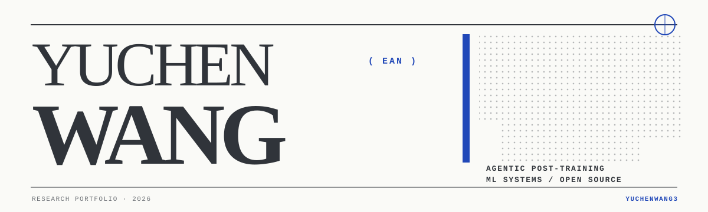

<picture>
  <source media="(prefers-color-scheme: dark)" srcset="./assets/editorial-header-dark.svg">
  
</picture>

  <a href="https://yuchenwang3.github.io">PORTFOLIO</a> ·
  <a href="https://yuchenwang3.github.io/CV.pdf">CV</a> ·
  <a href="https://scholar.google.com/citations?user=NharhG8AAAAJ">SCHOLAR</a> ·
  <a href="https://www.linkedin.com/in/yuchen3">LINKEDIN</a> ·
  <a href="https://huggingface.co/occamy-ai/occamy-1.0">HUGGING FACE</a> ·
  <a href="mailto:yuchenwang0303@gmail.com">EMAIL</a>

## 01 / Current

**Research Scientist Intern at Alibaba** — agentic LLM post-training,
long-horizon tool use, evaluation infrastructure, and learning systems.

M.S. Computer Science at **UIUC**. B.S. in Intelligent Science and Technology
(AI) from **Peking University, Zhi Class**.

`POST-TRAINING / RL / LONG-CONTEXT / ML SYSTEMS`

## 02 / Occamy-1.0

**[Occamy-1.0](https://huggingface.co/occamy-ai/occamy-1.0)** is a 35B-A3B
co-work model continued from Qwen3.6-35B-A3B through full-parameter SFT,
uniform model soup, and GRPO/SAO reinforcement learning.

As a core contributor, I architected and delivered verifier-gated data and
training infrastructure for token-exact replay, state reconstruction, episode
credit across context rewrites, immutable provenance, and quarantine gates.
On the same frozen ClawEval harness, the resulting system raised Combined T/C
Strict Pass@1/3 from **65.16/73.87% to 77.39/85.93%** while using **38.6% fewer
tokens per trajectory**.

## 03 / Selected upstream engineering

| Focus                        | Upstream work                                                                                                                                                                                                                                                                                                        |
| ---------------------------- | -------------------------------------------------------------------------------------------------------------------------------------------------------------------------------------------------------------------------------------------------------------------------------------------------------------------- |
| Optimizer stability          | Scale-invariant Newton–Schulz for small-norm Muon inputs — [NVIDIA NeMo Emerging Optimizers #230](https://github.com/NVIDIA-NeMo/Emerging-Optimizers/pull/230)                                                                                                                                                       |
| Hybrid-model training        | Recompute propagation and Mamba + attention + MoE runtime fixes — [vLLM/Vime #337](https://github.com/vllm-project/vime/pull/337)                                                                                                                                                                                    |
| Training throughput          | Sequence packing, NCCL warmup, and Muon correctness — [ModelScope ms-swift #9598](https://github.com/modelscope/ms-swift/pull/9598), [#9602](https://github.com/modelscope/ms-swift/pull/9602), [#9599](https://github.com/modelscope/ms-swift/pull/9599), [#9591](https://github.com/modelscope/ms-swift/pull/9591) |
| Long-context kernels         | Fused GatedDeltaNet Q/K normalization and selective Mamba recompute — [Megatron-LM #5396](https://github.com/NVIDIA/Megatron-LM/pull/5396), [#5463](https://github.com/NVIDIA/Megatron-LM/pull/5463)                                                                                                                 |
| RL and inference reliability | Safer rollout logprobs and hybrid-model weight reloads — [NeMo RL #2962](https://github.com/NVIDIA-NeMo/RL/pull/2962), [SGLang #31621](https://github.com/sgl-project/sglang/pull/31621)                                                                                                                             |

## 04 / Papers and systems

- **[CineFlow](https://raw.githubusercontent.com/yuchenwang3/yuchenwang3.github.io/main/assets/pdf/projects/cineflow-paper.pdf)** — semantic dependency scheduling for parallel video generation; **1.7–5.5× speedup** and up to **17.3% higher VBench overall**.
- **[Dynamic Prefill Optimization](https://raw.githubusercontent.com/yuchenwang3/yuchenwang3.github.io/main/assets/pdf/projects/dynamic-prefill-online-packing-report.pdf)** — AIMD control with p95 TTFT feedback and greedy/DP prompt packing; up to **20% lower TTFT** on production-style traces.
- **[FlashAttention-style CUDA Optimization](https://raw.githubusercontent.com/yuchenwang3/yuchenwang3.github.io/main/assets/pdf/projects/gpt2-processing-unit-report.pdf)** — tiled online softmax and kernel fusion for GPT-2; roughly **10× lower HBM traffic** and up to **9% end-to-end speedup**.
- **[RL for Legal Reasoning](https://raw.githubusercontent.com/yuchenwang3/yuchenwang3.github.io/main/assets/pdf/projects/legal-reasoning-thesis.pdf)** — Zero-RL → distilled-CoT SFT → GRPO, reaching **57.6% accuracy**.

## 05 / Working set

`Python · C++ · CUDA · PyTorch · Megatron-LM · NeMo · vLLM · SGLang · distributed training · reinforcement learning`

## 06 / GitHub signal

  <picture>
    <source media="(prefers-color-scheme: dark)" srcset="https://github-profile-summary-cards.vercel.app/api/cards/stats?username=yuchenwang3&theme=github_dark" />
    <source media="(prefers-color-scheme: light)" srcset="https://github-profile-summary-cards.vercel.app/api/cards/stats?username=yuchenwang3&theme=github" />
    
  </picture>
  <picture>
    <source media="(prefers-color-scheme: dark)" srcset="https://github-profile-summary-cards.vercel.app/api/cards/repos-per-language?username=yuchenwang3&theme=github_dark" />
    <source media="(prefers-color-scheme: light)" srcset="https://github-profile-summary-cards.vercel.app/api/cards/repos-per-language?username=yuchenwang3&theme=github" />
    
  </picture>

<picture>
  <source media="(prefers-color-scheme: dark)" srcset="https://raw.githubusercontent.com/yuchenwang3/yuchenwang3/output/github-snake-dark.svg" />
  <source media="(prefers-color-scheme: light)" srcset="https://raw.githubusercontent.com/yuchenwang3/yuchenwang3/output/github-snake.svg" />
  
</picture>

  

To an unceasing future. 致永无止境的明天。

