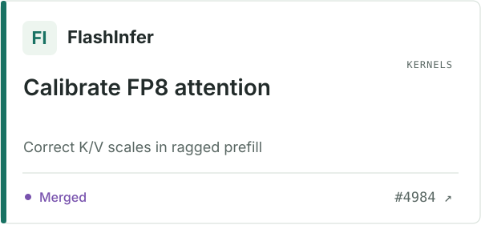
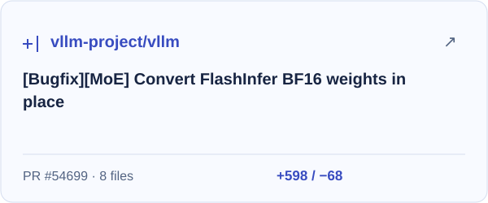
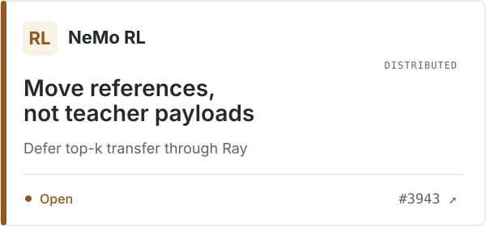
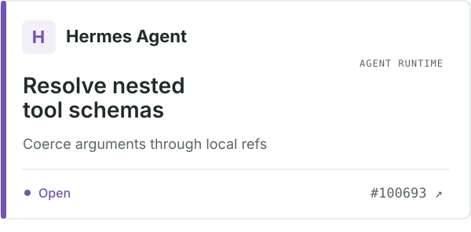
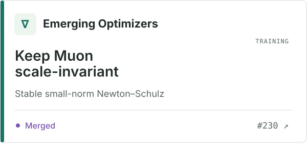
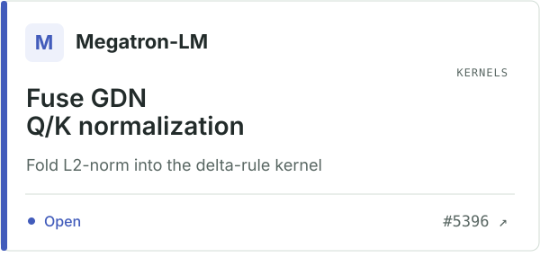
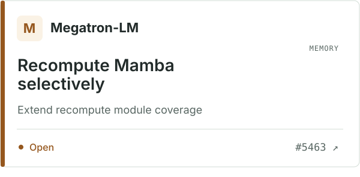
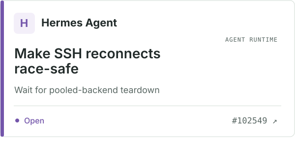

# Yuchen (Ean) Wang

I work on agentic post-training and ML systems. I am an M.S. student in Computer Science at UIUC and a research intern with Alibaba's Accio team. Previously, I studied AI at Peking University in the Zhi Class.

My interests include long-horizon tool use, reinforcement learning, efficient training and inference, and video generation.

[Website](https://yuchenwang3.github.io/) · [CV](https://yuchenwang3.github.io/CV.pdf) · [Google Scholar](https://scholar.google.com/citations?user=NharhG8AAAAJ) · [LinkedIn](https://www.linkedin.com/in/yuchen3) · [Email](mailto:yuchenwang0303@gmail.com)

## Research

- **[Occamy-1.0](https://accio-lab.github.io/occamy/)** — Core contributor to a 35B-A3B agent model. I built execution-grounded data and post-training infrastructure: verifier-gated collection, token-exact replay, state recovery, and compaction-aware training traces. The released model improves Claw-Eval average from 69.5 to 82.2 and AutomationBench strict pass from 7.5% to 27.6%. [arXiv](https://arxiv.org/abs/2609.11977) · [Website](https://accio-lab.github.io/occamy/) · [Model](https://huggingface.co/Accio-Lab/Occamy-1.0) · [Code](https://github.com/Accio-Lab/occamy)
- **[CineFlow](https://yuchenwang3.github.io/projects/cineflow/)** — Dependency-aware video generation with semantic DAGs and runtime scheduling, without retraining. Across three video models on 8×H100: 1.7–5.5× end-to-end speedup and 5.4–17.3% higher VBench overall.
- **[Dynamic Prefill Optimization](https://yuchenwang3.github.io/projects/prepack/)** — AIMD control with p95 TTFT feedback and length-aware prompt packing; up to 20% lower TTFT on production-style traces.

Other projects: [CUDA attention kernels](https://yuchenwang3.github.io/assets/pdf/projects/gpt2-processing-unit-report.pdf) · [RL for legal reasoning](https://yuchenwang3.github.io/assets/pdf/projects/legal-reasoning-thesis.pdf)

## Open-source engineering

- **[vLLM](https://github.com/vllm-project/vllm/pull/54699):** In-place BF16 MoE conversion, halving TP2 conversion peak allocation from 7.88 to 3.94 GiB.
- **[NeMo RL](https://github.com/NVIDIA-NeMo/RL/pull/3943):** Deferred teacher top-k payloads, with 4.44–5.31× speedup in controlled Ray transfer measurements.
- **[FlashInfer](https://github.com/flashinfer-ai/flashinfer/pull/4984) / [Emerging Optimizers](https://github.com/NVIDIA-NeMo/Emerging-Optimizers/pull/230):** FP8 KV calibration and scale-invariant small-norm Muon normalization.
- **[Megatron-LM](https://github.com/NVIDIA/Megatron-LM/pull/5396):** Fused GatedDeltaNet Q/K normalization and [selective Mamba recompute](https://github.com/NVIDIA/Megatron-LM/pull/5463).
- **[Hermes Agent](https://github.com/NousResearch/hermes-agent/pull/100693) / [NeMo Gym](https://github.com/NVIDIA-NeMo/Gym/pull/2726):** Tool-argument coercion, [SSH teardown/reconnect](https://github.com/NousResearch/hermes-agent/pull/102549), and co-authored cross-process HTTP error propagation.

[Engineering notes](https://yuchenwang3.github.io/projects/open-source-systems/) · [All pull requests](https://github.com/search?q=author%3Ayuchenwang3+is%3Apr&type=pullrequests)

PR previews · updated daily

<!-- PR-PREVIEWS:START -->

<a href="https://github.com/flashinfer-ai/flashinfer/pull/4984"><picture>
<source media="(prefers-color-scheme: dark)" srcset="./assets/prs/flashinfer-ai-flashinfer-4984-dark.svg">

</picture></a>
<a href="https://github.com/vllm-project/vllm/pull/54699"><picture>
<source media="(prefers-color-scheme: dark)" srcset="./assets/prs/vllm-project-vllm-54699-dark.svg">

</picture></a>
<a href="https://github.com/NVIDIA-NeMo/RL/pull/3943"><picture>
<source media="(prefers-color-scheme: dark)" srcset="./assets/prs/NVIDIA-NeMo-RL-3943-dark.svg">

</picture></a>
<a href="https://github.com/NousResearch/hermes-agent/pull/100693"><picture>
<source media="(prefers-color-scheme: dark)" srcset="./assets/prs/NousResearch-hermes-agent-100693-dark.svg">

</picture></a>
<a href="https://github.com/NVIDIA-NeMo/Emerging-Optimizers/pull/230"><picture>
<source media="(prefers-color-scheme: dark)" srcset="./assets/prs/NVIDIA-NeMo-Emerging-Optimizers-230-dark.svg">

</picture></a>
<a href="https://github.com/NVIDIA/Megatron-LM/pull/5396"><picture>
<source media="(prefers-color-scheme: dark)" srcset="./assets/prs/NVIDIA-Megatron-LM-5396-dark.svg">

</picture></a>
<a href="https://github.com/NVIDIA/Megatron-LM/pull/5463"><picture>
<source media="(prefers-color-scheme: dark)" srcset="./assets/prs/NVIDIA-Megatron-LM-5463-dark.svg">

</picture></a>
<a href="https://github.com/NousResearch/hermes-agent/pull/102549"><picture>
<source media="(prefers-color-scheme: dark)" srcset="./assets/prs/NousResearch-hermes-agent-102549-dark.svg">

</picture></a>

[All upstream contributions](https://github.com/search?q=author%3Ayuchenwang3+is%3Apr&type=pullrequests) · Previews refresh daily.

<!-- PR-PREVIEWS:END -->

