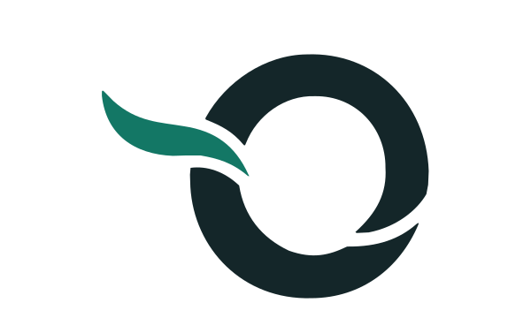
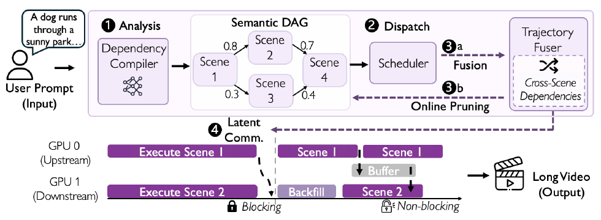
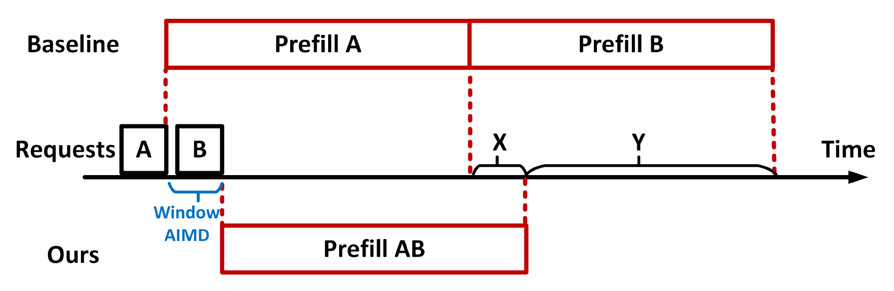

<picture>
<source media="(prefers-color-scheme: dark)" srcset="./assets/editorial-header-dark.svg">

</picture>

M.S. CS @ UIUC · Research intern @ Alibaba Accio · PKU Zhi Class.

    

## Research

<table>
<tr>
<td width="32%" align="center"><a href="https://accio-lab.github.io/occamy/"><picture><source media="(prefers-color-scheme: dark)" srcset="./assets/research/occamy-mark-dark.svg"></picture></a></td>
<td width="68%"><h3><a href="https://accio-lab.github.io/occamy/">Occamy-1.0</a></h3>

35B-A3B agent model for long-horizon tool use. Execution-grounded data · Agentic post-training

   
</td>
</tr>
<tr>
<td width="32%" align="center"></td>
<td width="68%"><h3><a href="https://yuchenwang3.github.io/projects/cineflow/">CineFlow</a></h3>

Dependency-driven parallel video generation. 1.7–5.5× end-to-end speedup in the reported evaluation

 
</td>
</tr>
<tr>
<td width="32%" align="center"></td>
<td width="68%"><h3><a href="https://yuchenwang3.github.io/projects/prepack/">Dynamic Prefill</a></h3>

Adaptive batching and prompt packing for LLM serving. Up to 20% lower TTFT on the reported traces

 
</td>
</tr>
</table>

 

## Open-source contributions

<!-- PR-PREVIEWS:START -->

<strong>8 merged</strong> · <strong>1 adopted solution</strong> · <strong>13 open</strong> · 12 projects

<table>
<tr>
<td width="28%" valign="top"><a href="https://github.com/modelscope/ms-swift"> <strong>ms-swift</strong></a></td>
<td width="72%">
 Add order-preserving packing

 Warm up NCCL before training

 Pass through Muon Nesterov settings

 Expose Muon coefficient selection
</td>
</tr>
<tr>
<td width="28%" valign="top"><a href="https://github.com/flashinfer-ai/flashinfer"> <strong>FlashInfer</strong></a></td>
<td width="72%">
 Calibrate FP8 attention
</td>
</tr>
<tr>
<td width="28%" valign="top"><a href="https://github.com/vllm-project/vime"> <strong>vime</strong></a></td>
<td width="72%">
 Forward recompute flags; fix hybrid models
</td>
</tr>
<tr>
<td width="28%" valign="top"><a href="https://github.com/NVIDIA-NeMo/Emerging-Optimizers"> <strong>Emerging Optimizers</strong></a></td>
<td width="72%">
 Keep Muon scale-invariant
</td>
</tr>
<tr>
<td width="28%" valign="top"><a href="https://github.com/NVIDIA-NeMo/Gym"> <strong>NeMo Gym</strong></a></td>
<td width="72%">
 Preserve HTTP errors across process boundaries Co-author
</td>
</tr>
<tr>
<td width="28%" valign="top"><a href="https://github.com/Dao-AILab/flash-attention"> <strong>FlashAttention</strong></a></td>
<td width="72%">
 Stabilize backward JIT keys without CPU–GPU sync <a href="https://github.com/Dao-AILab/flash-attention/pull/2507#issuecomment-4921776396">Solution adopted by the PR author</a>
</td>
</tr>
<tr>
<td width="28%" valign="top"><a href="https://github.com/vllm-project/vllm"> <strong>vLLM</strong></a></td>
<td width="72%">
 Convert MoE weights in place
</td>
</tr>
<tr>
<td width="28%" valign="top"><a href="https://github.com/NVIDIA/Megatron-LM"> <strong>Megatron-LM</strong></a></td>
<td width="72%">
 Fuse GDN Q/K normalization

 Recompute Mamba selectively

 Route GDN input projections to Adam

 Exclude GDN input projections from global clipping

 Skip gradient clipping for Muon
</td>
</tr>
<tr>
<td width="28%" valign="top"><a href="https://github.com/NVIDIA-NeMo/RL"> <strong>NeMo RL</strong></a></td>
<td width="72%">
 Move references, not teacher payloads

 Sanitize non-finite async log probabilities
</td>
</tr>
<tr>
<td width="28%" valign="top"><a href="https://github.com/sgl-project/sglang"> <strong>SGLang</strong></a></td>
<td width="72%">
 Explain cold MXFP4 JIT startup

 Honor weight-check exclusions during reset
</td>
</tr>
<tr>
<td width="28%" valign="top"><a href="https://github.com/verl-project/verl"> <strong>verl</strong></a></td>
<td width="72%">
 Validate actor FSDP strategy
</td>
</tr>
<tr>
<td width="28%" valign="top"><a href="https://github.com/NousResearch/hermes-agent"> <strong>Hermes Agent</strong></a></td>
<td width="72%">
 Resolve nested tool schemas

 Make SSH reconnects race-safe
</td>
</tr>
</table>

 

<!-- PR-PREVIEWS:END -->
