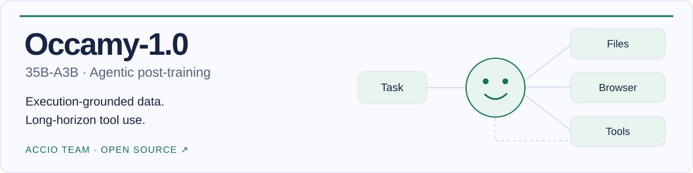
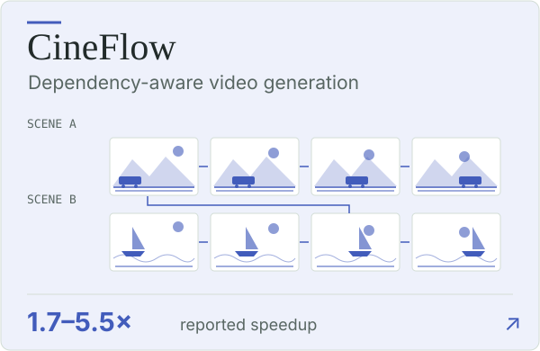
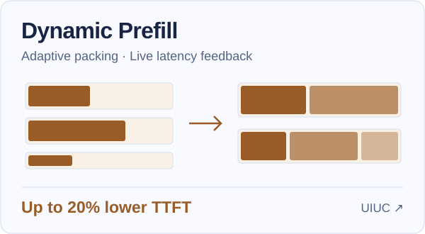

<picture>
  <source media="(prefers-color-scheme: dark)" srcset="./assets/editorial-header-dark.svg">
  
</picture>

  
  
  
  

Agentic post-training & ML systems. M.S. CS @ UIUC · Research intern @ Alibaba Accio · PKU Zhi Class. [Get in touch ↗](mailto:yuchenwang0303@gmail.com)

## Research

<a href="https://accio-lab.github.io/occamy/"><picture>
<source media="(prefers-color-scheme: dark) and (max-width: 600px)" srcset="./assets/research/occamy-compact-dark.svg">
<source media="(max-width: 600px)" srcset="./assets/research/occamy-compact-light.svg">
<source media="(prefers-color-scheme: dark)" srcset="./assets/research/occamy-dark.svg">

</picture></a>

[arXiv](https://arxiv.org/abs/2609.11977) · [Website](https://accio-lab.github.io/occamy/) · [Model](https://huggingface.co/Accio-Lab/Occamy-1.0) · [Code](https://github.com/Accio-Lab/occamy)

<a href="https://yuchenwang3.github.io/projects/cineflow/"><picture>
<source media="(prefers-color-scheme: dark)" srcset="./assets/research/cineflow-dark.svg">

</picture></a>
<a href="https://yuchenwang3.github.io/projects/prepack/"><picture>
<source media="(prefers-color-scheme: dark)" srcset="./assets/research/prefill-dark.svg">

</picture></a>

Other projects: [CUDA attention kernels](https://yuchenwang3.github.io/assets/pdf/projects/gpt2-processing-unit-report.pdf) · [RL for legal reasoning](https://yuchenwang3.github.io/assets/pdf/projects/legal-reasoning-thesis.pdf)

## Open-source engineering

[Engineering notes](https://yuchenwang3.github.io/projects/open-source-systems/)

PR previews · updated daily

<!-- PR-PREVIEWS:START -->

<a href="https://github.com/flashinfer-ai/flashinfer/pull/4984"><picture>
<source media="(prefers-color-scheme: dark)" srcset="./assets/prs/flashinfer-ai-flashinfer-4984-dark.svg">

</picture></a>
<a href="https://github.com/vllm-project/vllm/pull/54699"><picture>
<source media="(prefers-color-scheme: dark)" srcset="./assets/prs/vllm-project-vllm-54699-dark.svg">

</picture></a>
<a href="https://github.com/NVIDIA-NeMo/RL/pull/3943"><picture>
<source media="(prefers-color-scheme: dark)" srcset="./assets/prs/NVIDIA-NeMo-RL-3943-dark.svg">

</picture></a>
<a href="https://github.com/NousResearch/hermes-agent/pull/100693"><picture>
<source media="(prefers-color-scheme: dark)" srcset="./assets/prs/NousResearch-hermes-agent-100693-dark.svg">

</picture></a>
<a href="https://github.com/NVIDIA-NeMo/Emerging-Optimizers/pull/230"><picture>
<source media="(prefers-color-scheme: dark)" srcset="./assets/prs/NVIDIA-NeMo-Emerging-Optimizers-230-dark.svg">

</picture></a>
<a href="https://github.com/NVIDIA/Megatron-LM/pull/5396"><picture>
<source media="(prefers-color-scheme: dark)" srcset="./assets/prs/NVIDIA-Megatron-LM-5396-dark.svg">

</picture></a>
<a href="https://github.com/NVIDIA/Megatron-LM/pull/5463"><picture>
<source media="(prefers-color-scheme: dark)" srcset="./assets/prs/NVIDIA-Megatron-LM-5463-dark.svg">

</picture></a>
<a href="https://github.com/NousResearch/hermes-agent/pull/102549"><picture>
<source media="(prefers-color-scheme: dark)" srcset="./assets/prs/NousResearch-hermes-agent-102549-dark.svg">

</picture></a>

[All upstream contributions](https://github.com/search?q=author%3Ayuchenwang3+is%3Apr&type=pullrequests) · Previews refresh daily.

<!-- PR-PREVIEWS:END -->

